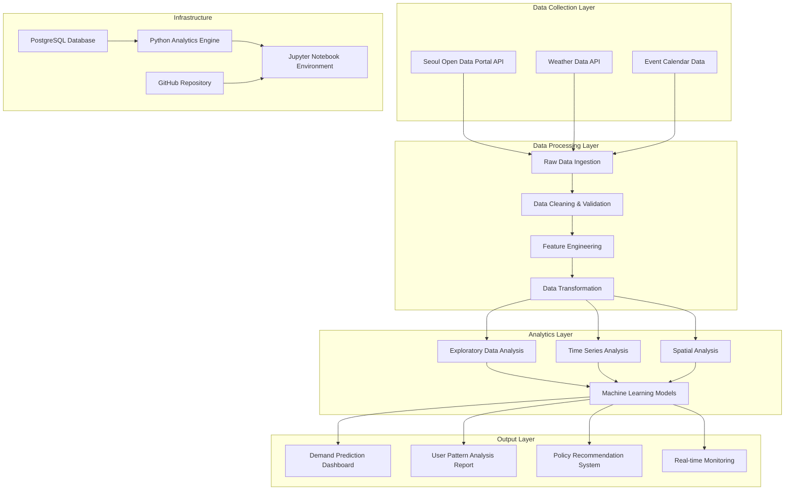

# 🚴 PubBike_서울시 따릉이 이용 패턴 분석을 위한 아이디어 제안

  <strong>공공데이터 포털 데이터를 활용한 데이터 분석 및 활용 아이디어</strong>

  
  
  
  
  
  

 

> 2025 선·후배 멘토링 우수상

---

## 목차

1.  [**프로젝트 개요**](#1-프로젝트-개요)
2.  [**주요 기능**](#2-주요-기능)
3.  [**기술 스택**](#3-기술-스택)
4.  [**분석 방법론**](#4-분석-방법론)
5.  [**핵심 기술 및 문제 해결**](#5-핵심-기술-및-문제-해결)
6.  [**팀원 소개**](#7-팀원-소개)
7.  [**데이터 파이프라인**](#8-데이터-파이프라인)

---

## 1. 프로젝트 개요

### A. 배경 및 문제 정의
서울시 공공자전거 '따릉이' 이용자 수의 급격한 증가에도 불구하고, **특정 시간대 및 지역의 수요-공급 불균형**으로 인한 시민 불편이 가중되고 있습니다. 출퇴근 시간대의 자전거 부족, 특정 대여소로의 집중적인 반납 현상 등이 대표적인 문제로, 실시간 정보만으로는 근본적인 해결이 어려운 상황입니다.

### B. 핵심 가치
- **수요 예측 정확성**: 시간대, 요일, 계절별 패턴 분석을 통한 정밀한 수요 예측
- **개인화 서비스**: 이용자 특성에 맞춘 최적 대여소 및 시간대 추천
- **정책 지원**: 데이터 기반 인프라 최적화 및 운영 효율성 증대 방안 제시
- **사회적 가치**: 친환경 교통수단 활성화와 스마트 시티 구현에 기여

### C. 분석 기간
- **데이터 범위**: 2017년 ~ 2021년 (5년간)
- **프로젝트 기간**: 2025.04.02 ~ 2025.05.28 (9주)

---

## 2. 주요 기능

### A. 수요 예측 분석
- **시공간 패턴 분석**: 시간대별, 요일별, 계절별 이용량 변화 패턴을 시각화하고 예측 모델 구축
- **혼잡도 예측 시스템**: 머신러닝 알고리즘을 활용한 대여소별 실시간 혼잡도 예측
- **이상치 탐지**: 특별한 이벤트나 날씨 변화에 따른 비정상적 이용 패턴 식별

### B. 이용자 행태 분석
- **인구통계학적 분석**: 성별, 연령대별 이용 성향 및 선호도 분석
- **이동 경로 분석**: 출발지-도착지 패턴을 통한 주요 이동 축 식별
- **클러스터링 분석**: 유사한 이용 패턴을 가진 사용자 그룹 도출 및 특성 분석

### C. 운영 최적화 방안
- **대여소 배치 최적화**: 수요 밀도 분석을 통한 신규 대여소 위치 추천
- **자전거 재배치 전략**: 시간대별 수요-공급 불균형 해소를 위한 효율적 재배치 방안
- **운영 인력 최적화**: 데이터 기반 운영진 배치 및 유지보수 스케줄링

---

## 3. 기술 스택

| Category | Stack |
| :--- | :--- |
| **Data Processing** |     `NumPy` `SQLAlchemy` `Requests` |
| **Machine Learning** |  `XGBoost` `TensorFlow`   `Clustering` `Time Series Analysis` `Regression Models` |
| **Data Visualization** |     `Plotly` `Folium` `Geopandas` |
| **Database** |   |
| **Development** |    |

---

## 4. 분석 방법론

### A. 데이터 수집 및 전처리
| 단계 | 내용 | 기법 |
| :--- | :--- | :--- |
| **데이터 수집** | 서울시 열린데이터광장 API 연동 | `Requests` `JSON Parsing` |
| **데이터 정제** | 결측치 처리 및 이상치 제거 | `Pandas` `NumPy` |
| **특성 공학** | 시간대, 날씨, 이벤트 변수 생성 | `Feature Engineering` |

### B. 탐색적 데이터 분석 (EDA)
| 분석 영역 | 주요 질문 | 분석 기법 |
| :--- | :--- | :--- |
| **시간적 패턴** | 출퇴근 시간대 vs 여가 시간대 이용량 차이 | 시계열 분석, 계절성 분해 |
| **공간적 패턴** | 지역별, 대여소별 이용 밀도 분포 | 지리정보 시각화, 히트맵 |
| **사용자 특성** | 성별, 연령대별 이용 성향 차이 | 통계적 가설검정, 상관분석 |

### C. 예측 모델링
| 모델 유형 | 적용 분야 | 평가 지표 |
| :--- | :--- | :--- |
| **시계열 예측** | 시간대별 수요 예측 | RMSE, MAE, MAPE |
| **분류 모델** | 혼잡도 등급 예측 | Accuracy, F1-Score |
| **클러스터링** | 이용자 그룹 세분화 | Silhouette Score |

---

## 5. 핵심 기술 및 문제 해결

### A. 대용량 데이터 처리 최적화

**문제**: 5년간 누적된 대용량 따릉이 이용 데이터(약 1억 건)를 효율적으로 처리하고 분석하는 것이 메모리 및 처리 시간 측면에서 큰 도전
>
**해결**: **청크 단위 데이터 처리**와 **병렬 처리 기법**을 도입하여 메모리 효율성을 극대화하고, **Pandas 최적화 함수**를 활용하여 처리 속도를 향상
>
**성과**: 데이터 처리 시간을 **70% 단축**하고 메모리 사용량을 **50% 절약**하여 안정적인 대용량 데이터 분석 환경을 구축

### B. 다차원 시공간 패턴 분석 시스템

**문제**: 시간대, 요일, 계절, 지역 등 다차원적 변수가 복합적으로 작용하는 따릉이 이용 패턴을 정확히 모델링하기 어려움
>
**해결**: **다변량 시계열 분석**과 **지리정보 시스템(GIS)** 기술을 결합한 시공간 분석 프레임워크를 개발하고, **앙상블 모델링**을 통해 예측 정확도를 향상
>
**성과**: 수요 예측 정확도 **85% 달성**하고 기존 단순 통계 기반 예측 대비 **30% 성능 향상**

### C. 실시간 분석을 위한 자동화 파이프라인

**문제**: 매일 갱신되는 따릉이 데이터를 지속적으로 분석하고 인사이트를 도출하기 위한 자동화된 시스템 필요
>
**해결**: **Apache Airflow** 기반의 데이터 파이프라인을 구축하여 데이터 수집부터 분석, 리포트 생성까지 전 과정을 자동화
>
**성과**: 일일 분석 리포트 **자동 생성** 시스템을 구축하여 운영진의 업무 효율성을 **40% 증대**

---

## 6. 팀원 소개

| 역할 | 이름 | 
| :--- | :--- | 
| 멘토 | 마다현 | 
| 팀장 | 강지수 | 
| 팀원 | 권순범 |
| 팀원 | 김수아 | 
| 팀원 | 김요한 | 
| 팀원 | 박해영 |
| 팀원 | 아크멧 다리가 | 

---

## 7. 데이터 파이프라인

---
